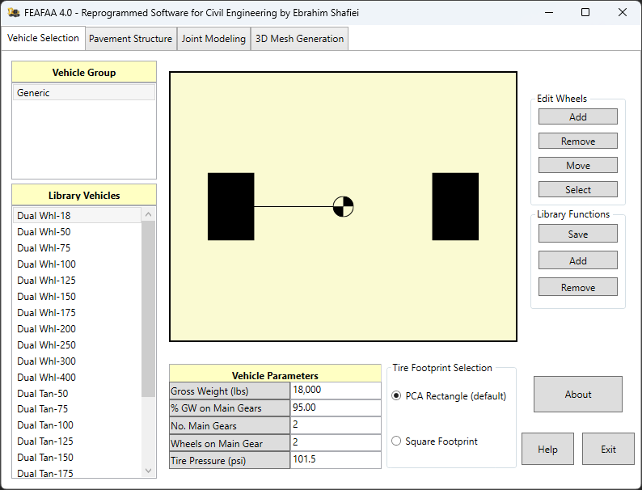

# 🏗️ FEAFAA 4.0 – تحلیل اجزای محدود روسازی صلب بتن غلتکی

 | 

  

## 🎯 چرا این نرم‌افزار ساخته شده؟

نرم‌افزار **FEAFAA** (Finite Element Airport Pavement Analysis for Aircraft) نسخه 3.0، یک ابزار تخصصی در زمینه تحلیل روسازی (Pavement Analysis) فرودگاه‌ها است که توسط نهادهای تحقیقاتی و توسعه فناوری‌های هوانوردی (Airport Technology R&D) طراحی و توسعه داده شده است.

این نرم‌افزار بر پایه روش **اجزای محدود** (Finite Element Method – FEM) عمل می‌کند و امکان تحلیل دقیق رفتار سازه‌ای باندهای فرود، تاکسی‌وی‌ها و رمپ‌های هواپیما را در برابر بارگذاری‌های سنگین هواپیماهای مدرن فراهم می‌سازد.

### 🔧 سفارشی‌سازی برای رشته عمران

در نسخه جدید FEAFAA 4.0 که توسط ابراهیم شفیعی (EbraSha) توسعه و سفارشی‌سازی شده است، نرم‌افزار از محدوده فرودگاهی فراتر رفته و برای کاربردهای تخصصی در رشته مهندسی عمران قابل استفاده است. این نسخه به‌طور ویژه برای تحلیل روسازی‌های صلب بتن غلتکی (Roller Compacted Concrete – RCC) تحت بارگذاری ماشین‌های سنگین و تجهیزات بردار پشتیبان طراحی شده است. به همین دلیل، دانشجویان و پژوهشگران عمران می‌توانند از آن برای انجام تحلیل‌های پیشرفته سازه‌ای، بررسی دوام، و بهینه‌سازی طرح‌های روسازی استفاده کنند.

### ✅ مشکلات حل شده

مشکلات این نسخه نسبت به نسخه قبل حل شده و بهبودهای قابل توجهی در عملکرد و پایداری نرم‌افزار اعمال شده است.

## 🚀 ویژگی‌ها و قابلیت‌ها

- **📊 تحلیل اجزای محدود پیشرفته (Advanced FEM Analysis):**  
  استفاده از روش اجزای محدود برای شبیه‌سازی دقیق رفتار روسازی‌های صلب بتن غلتکی

- **🚚 مدل‌سازی بارگذاری ماشین‌های سنگین (Heavy Vehicle Loading):**  
  امکان تعریف و شبیه‌سازی بارگذاری انواع ماشین‌آلات سنگین و تجهیزات عمرانی

- **🏗️ تحلیل روسازی‌های عمرانی (Civil Pavement Analysis):**  
  تمرکز بر روسازی‌های صلب بتن غلتکی (RCC Pavements) و رفتار آن‌ها تحت بارهای واقعی

- **📈 نتایج دقیق و قابل اعتماد (Reliable Results):**  
  تولید داده‌های تحلیلی معتبر برای پژوهش‌های دانشگاهی و پروژه‌های اجرایی

- **🎓 مناسب برای آموزش و پژوهش (Education & Research Ready):**  
  طراحی شده برای دانشجویان و محققان رشته عمران جهت انجام پروژه‌های تحقیقاتی و پایان‌نامه‌ها

- **🔧 قابلیت سفارشی‌سازی (Customizable Parameters):**  
  امکان تنظیم پارامترهای مصالح، هندسه و شرایط بارگذاری متناسب با نیاز پروژه

## 📖 نحوه استفاده

### پیش‌نیازها
- Windows 10 یا بالاتر
- .NET Framework 4.7 یا بالاتر
- حداقل 4GB RAM
- فضای دیسک 500MB

### نصب و راه‌اندازی
1. فایل اجرایی نرم‌افزار را دانلود کنید
2. فایل را اجرا کنید
3. تنظیمات اولیه را انجام دهید
4. شروع به تحلیل کنید

### مراحل تحلیل

1. **تعریف پارامترهای بارگذاری**: انتخاب نوع ماشین سنگین یا تجهیزات عمرانی و شرایط بارگذاری
2. **تنظیم پارامترهای روسازی**: تعریف لایه‌های روسازی صلب بتن غلتکی (RCC) و خواص مکانیکی مصالح
3. **مدل‌سازی درزها و مفاصل**: تعیین خصوصیات درزهای انقباضی و اتصالات سازه‌ای
4. **تولید مش (Meshing):** ایجاد شبکه اجزای محدود برای شبیه‌سازی دقیق رفتار سازه
5. **اجرای تحلیل و دریافت نتایج**: انجام محاسبات و استخراج خروجی‌های عددی و نموداری برای بررسی عملکرد روسازی

## 🐛 گزارش مشکلات

اگر با مشکلی مواجه شدید یا در پیکربندی مشکل دارید، لطفاً از طریق ایمیل Prof.Shafiei@Gmail.com با ما در تماس باشید. همچنین می‌توانید مشکلات را در GitLab یا GitHub گزارش دهید.

## ❤️ حمایت مالی

اگر این پروژه برای شما مفید بود و مایل به حمایت از توسعه بیشتر هستید، لطفاً در نظر داشته باشید که کمک مالی کنید:
- [اینجا اهدا کنید](https://alphajet.ir/abdal-donation)

## 🤵 برنامه‌نویس

ساخته شده با عشق توسط **ابراهیم شفیعی (EbraSha)**
- **ایمیل**: Prof.Shafiei@Gmail.com
- **تلگرام**: [@ProfShafiei](https://t.me/ProfShafiei)

## 📜 مجوز

این پروژه تحت مجوز GPLv2 or later منتشر شده است.
